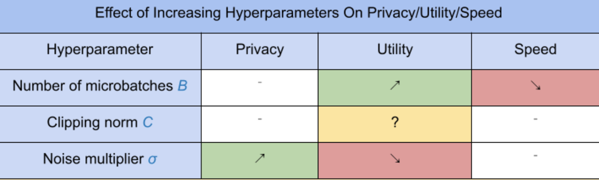

# Get Started

This document assumes you are already familiar with differential privacy, and
have determined that you would like to use TF Privacy to implement differential
privacy guarantees in your model(s). If you’re not familiar with differential
privacy, please review
[the overview page](https://tensorflow.org/responsible_ai/privacy/guide). After
installing TF Privacy, get started by following these steps:

## 1. Choose a differentially private version of an existing Optimizer

If you’re currently using a TensorFlow
[optimizer](https://www.tensorflow.org/api_docs/python/tf/keras/optimizers), you
will most likely want to select an Optimizer with the name `DPKeras*Optimizer`,
such as [`DPKerasAdamOptimizer`] in [`TF Privacy`].

Optionally, you may try vectorized optimizers like
[`tf_privacy.VectorizedDPKerasAdamOptimizer`]. for a possible speed improvement
(in terms of global steps per second). The use of vectorized optimizers has been
found to provide inconsistent speedups in experiments, but is not yet well
understood. As before, you will most likely want to use an optimizer analogous
to the one you're using now. These vectorized optimizers use Tensorflow's
`vectorized_map` operator, which may not work with some other Tensorflow
operators. If this is the case for you, please
[open an issue on the TF Privacy GitHub repository](https://github.com/tensorflow/privacy/issues).

## 2. Compute loss for your input minibatch

When computing the loss for your input minibatch, make sure it is a vector with
one entry per example, instead of aggregating it into a scalar. This is
necessary since DP-SGD must be able to compute the loss for individual
microbatches.

## 3. Train your model

Train your model using the DP Optimizer (step 1) and vectorized loss (step 2).
There are two options for doing this:

*   Pass the optimizer and loss as arguments to `Model.compile` before calling
    `Model.fit`.
*   When writing a custom training loop, use `Optimizer.minimize()` on the
    vectorized loss.

Once this is done, it’s recommended that you tune your hyperparameters. For a
complete walkthrough see the
[classification privacy tutorial](../tutorials/classification_privacy.ipynb)

## 4. Tune the DP-SGD hyperparameters

All `tf_privacy` optimizers take three additional hyperparameters:

*   `l2_norm_clip` or $C$ - Clipping norm (the maximum Euclidean (L2) norm of
    each individual gradient computed per minibatch).
*   `noise_multiplier` or $σ$ - Ratio of the standard deviation to the clipping
    norm.
*   `num_microbatches` or $B$ - Number of microbatches into which each minibatch
    is split.

Generally, the lower the effective standard deviation $σC / B$, the better the
performance of the trained model on its evaluation metrics.

The three new DP-SGD hyperparameters have the following effects and tradeoffs:

1.  The number of microbatches $B$: Generally, increasing this will improve
    utility because it lowers the standard deviation of the noise. However, it
    will slow down training in terms of time.
2.  The clipping norm $C$: Since the standard deviation of the noise scales with
    $C$, it is probably best to set $C$ to be some quantile (e.g. median, 75th
    percentile, 90th percentile) of the gradient norms. Having too large a value
    of $C$ adds unnecessarily large amounts of noise.
3.  The noise multiplier $σ$: Of the three hyperparameters, the amount of
    privacy depends only on the noise multiplier. The larger the noise
    multiplier, the more privacy is obtained; however, this also comes with a
    loss of utility.

These tradeoffs between utility, privacy, and speed in terms of steps/second are
summarized here:

Follow these suggestions to find the optimal hyperparameters:

*   Set $C$ to a quantile as recommended above. A value of 1.00 often works
    well.
*   Set $B$ = 1, for maximum training speed.
*   Experiment to find the largest value of σ that still gives acceptable
    utility. Generally, values of 0.01 or lower have been observed to work well.
*   Once a suitable value of $σ$ is found, scale both $B$ and $σ$ by a constant
    to achieve a reasonable level of privacy.
