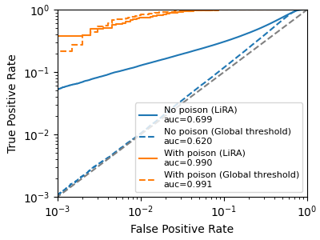

## Truth Serum: Poisoning Machine Learning Models to Reveal Their Secrets

This directory contains code to reproduce results from the paper:

**"Truth Serum: Poisoning Machine Learning Models to Reveal Their Secrets"**<br>
https://arxiv.org/abs/2204.00032 <br>
by Florian Tramèr, Reza Shokri, Ayrton San Joaquin, Hoang Le, Matthew Jagielski, Sanghyun Hong and Nicholas Carlini

### INSTALLING

The experiments in this directory are built on top of the
[LiRA membership inference attack](../mi_lira_2021).

After following the [installation instructions](../mi_lira_2021#installing) for
LiRa, make sure the attack code is on your `PYTHONPATH`:

```bash
export PYTHONPATH="${PYTHONPATH}:../mi_lira_2021"
```

### RUNNING THE CODE

#### 1. Train the models

The first step in our attack is to train shadow models, with some data points
targeted by a poisoning attack. You can train 16 shadow models with the command

> bash scripts/train_demo.sh

or if you have multiple GPUs on your machine and want to train these models in
parallel, then modify and run

> bash scripts/train_demo_multigpu.sh

This will train 16 CIFAR-10 wide ResNet models to ~91% accuracy each, with 250
points targeted for poisoning. For each of these 250 targeted points, the
attacker adds 8 mislabeled poisoned copies of the point into the training set.
The training run will output a bunch of files under the directory exp/cifar10
with structure:

```
exp/cifar10/
- xtrain.npy
- ytain.npy
- poison_pos.npy
- experiment_N_of_16
-- hparams.json
-- keep.npy
-- ckpt/
--- 0000000100.npz
-- tb/
```

The following flags control the poisoning attack:

-   `num_poison_targets (default=250)`. The number of targeted points.
-   `poison_reps (default=8)`. The number of replicas per poison.
-   `poison_pos_seed (default=0)`. The random seed to use to choose the target
    points.

We recommend that `num_poison_targets * poison_reps < 5000` on CIFAR-10, as
otherwise the poisons introduce too much label noise and the model's accuracy
(and the attack's success rate) will be degraded.

#### 2. Perform inference and compute scores

Exactly as for LiRA, we then evaluate the models on the entire CIFAR-10 dataset,
and generate logit-scaled membership inference scores. See
[here](../mi_lira_2021#2-perform-inference) and
[here](../mi_lira_2021#3-compute-membership-inference-scores) for details.

```bash
python3 -m inference --logdir=exp/cifar10/
python3 -m score exp/cifar10/
```

### PLOTTING THE RESULTS

Finally we can generate pretty pictures, and run the plotting code

```bash
python3 plot_poison.py
```

which should give (something like) the following output



```
Attack No poison (LiRA)
   AUC 0.7025, Accuracy 0.6258, TPR@0.1%FPR of 0.0544
Attack No poison (Global threshold)
   AUC 0.6191, Accuracy 0.6173, TPR@0.1%FPR of 0.0012
Attack With poison (LiRA)
   AUC 0.9943, Accuracy 0.9653, TPR@0.1%FPR of 0.4945
Attack With poison (Global threshold)
   AUC 0.9922, Accuracy 0.9603, TPR@0.1%FPR of 0.3930
```

where the baselines are LiRA and a simple global threshold on the membership
scores, both without poisoning. With poisoning, both LiRA and the global
threshold attack are boosted significantly. Note that because we only train a
few models, we use the fixed variance variant of LiRA.

### Citation

You can cite this paper with

```
@article{tramer2022truth,
  title={Truth Serum: Poisoning Machine Learning Models to Reveal Their Secrets},
  author={Tramer, Florian and Shokri, Reza and San Joaquin, Ayrton and Le, Hoang and Jagielski, Matthew and Hong, Sanghyun and Carlini, Nicholas},
  journal={arXiv preprint arXiv:2204.00032},
  year={2022}
}
```
